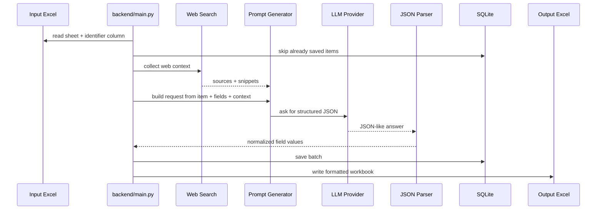

<div align="center">

<p align="center">
  
</p>

<h1 align="center">Factoria</h1>

<p align="center">
  <strong>AI-powered data collection toolkit that finds, structures, stores, and exports information from item lists.</strong>
</p>

<p align="center">
  
  
  
  
  
  
  <a href="LICENSE"></a>
</p>

<p align="center">
  
  
  
</p>

<p align="center">
  <a href="#-quick-start">Quick start</a> ·
  <a href="#-use-cases">Use cases</a> ·
  <a href="#-features">Features</a> ·
  <a href="#-why-not-just-use-chatgpt">Why not ChatGPT?</a> ·
  <a href="#-how-it-works">How it works</a> ·
  <a href="#-configuration">Configuration</a> ·
  <a href="SECURITY.md">Security</a> ·
  <a href="CONTRIBUTING.md">Contributing</a> ·
  <a href="CODE_OF_CONDUCT.md">Code of Conduct</a>
</p>

### Finds and structures any data.

</div>

---

## ✨ What Is Factoria?

**Factoria** turns a spreadsheet of items into structured, searchable data.

Give it an Excel file, define the identifier column and target fields, and it will enrich every row with web search context plus LLM extraction. It parses structured JSON, checkpoints progress into SQLite, and exports a formatted Excel report at the end.

It is built for long-running collection jobs where restarts, partial progress, and repeat runs should not destroy already collected results.

## 🎯 Use Cases

| Use case | Example |
| --- | --- |
| Product research | Enrich SKU lists with names, specs, dimensions, manufacturers, and sources |
| Supplier research | Collect company facts, countries, websites, and contact hints |
| Parts catalog cleanup | Convert messy spare-part lists into structured technical tables |
| Market research | Build structured datasets from search results and LLM summaries |
| Internal operations | Run repeatable spreadsheet enrichment jobs with checkpointing |

## 💎 Why It Feels Useful

Most data collection scripts break down when the list gets long.

Factoria keeps the workflow boring in the good way:

- **Excel in, Excel out**: use spreadsheets as the operator-facing interface.
- **SQLite checkpointing**: already processed items are skipped on the next run.
- **Structured fields**: responses are parsed into predictable columns.
- **Provider-based LLMs**: use OpenAI-compatible APIs, Gemini, or local Ollama models.
- **Web search context**: use Tavily, Brave Search, or DDGS fallback before extraction.
- **Batch processing**: configurable batch size for controlled throughput.
- **CLI and API modes**: inspect one item interactively or call the FastAPI backend.

## 🌟 Features

| Feature | What it does | Status |
| --- | --- | --- |
| 🧾 **Excel input** | Reads item identifiers from a configured sheet and column | Ready |
| 🧠 **Multi-provider LLM extraction** | Supports OpenAI-compatible APIs, Gemini, and Ollama | Ready |
| 🔎 **Web search enrichment** | Adds Tavily, Brave, or DDGS search context before LLM extraction | Ready |
| 🧩 **Configurable fields** | Uses `target_fields` to control the output schema | Ready |
| 🗄️ **SQLite storage** | Uses versioned migrations and checkpointing to avoid duplicate processing | Ready |
| 📊 **Formatted Excel export** | Writes a readable `.xlsx` report with wrapped cells and bold headers | Ready |
| 🖥️ **Single-item CLI** | Query one item and print a Rich table in the terminal | Ready |
| 🌐 **FastAPI backend** | Exposes health, settings, search, collect, items, jobs, and export endpoints | Ready |
| 🧪 **Typed codebase** | Ruff and strict mypy configuration are included | Ready |

## 🧠 Why Not Just Use ChatGPT?

ChatGPT is great for one-off questions.

Factoria is built for repeatable collection jobs:

- processes hundreds or thousands of spreadsheet rows
- remembers completed items through SQLite checkpointing
- keeps output fields consistent
- exports results back to Excel
- can combine web search context with LLM extraction
- survives restarts without losing progress

## 🧭 How It Works



## ⚡ Quick Start

Install dependencies:

```powershell
uv sync
```

Create local config:

```powershell
Copy-Item .env.example .env
```

Set your API values in `.env`:

```env
LLM_PROVIDER=openai-compatible
LLM_API_KEY=your_deepseek_or_openai_compatible_key_here
LLM_BASE_URL=https://api.deepseek.com/v1
LLM_MODEL=deepseek-chat

WEB_SEARCH_PROVIDER=tavily
WEB_SEARCH_API_KEY=your_tavily_key_here
```

Run the full collector:

```powershell
uv run python backend/main.py
```

Run a single item through the CLI:

```powershell
uv run python backend/cli.py "ABC-123"
```

Run the API backend:

```powershell
uv run uvicorn backend.api.app:app --host 0.0.0.0 --port 8000
```

## ⚙️ Configuration

Runtime settings are loaded from `.env` through `pydantic-settings`.

| Variable | Purpose | Default |
| --- | --- | --- |
| `LLM_PROVIDER` | LLM provider: `openai-compatible`, `gemini`, or `ollama` | `openai-compatible` |
| `LLM_API_KEY` | API key for hosted LLM providers | empty |
| `LLM_BASE_URL` | Provider base URL; Ollama defaults to local server | provider-specific |
| `LLM_MODEL` | Chat model name | falls back to `MODEL_NAME` |
| `LLM_TIMEOUT_SECONDS` | LLM request timeout | `60` |
| `OPENAI_API_KEY` | Legacy API key fallback for OpenAI-compatible providers | empty |
| `OPENAI_BASE_URL` | Legacy provider base URL fallback | `https://api.deepseek.com/v1` |
| `MODEL_NAME` | Legacy model name fallback | `deepseek-chat` |
| `WEB_SEARCH_ENABLED` | Enables search context before extraction | `true` |
| `WEB_SEARCH_PROVIDER` | Search provider: `tavily`, `brave`, or `ddgs` | `tavily` |
| `WEB_SEARCH_API_KEY` | API key for Tavily or Brave; empty falls back to DDGS | empty |
| `WEB_SEARCH_MAX_RESULTS` | Search results per item | `5` |
| `INPUT_FILE` | Excel input path | `input/input.xlsx` |
| `OUTPUT_FILE` | Excel output path | `results/output.xlsx` |
| `SHEET_NAME` | Sheet to read | `Task1` |
| `COLUMN_NAME` | Identifier column name | `Item ID` |
| `BATCH_SIZE` | Rows processed before flushing to SQLite | `5` |
| `DB_PATH` | SQLite database path | `results/database.sqlite` |

Default target fields live in [backend/config.py](backend/config.py). Change `target_fields`, `item_label`, and `system_prompt` there when adapting Factoria to a new domain.

### Supported Providers

| Layer | Providers |
| --- | --- |
| LLM | OpenAI-compatible APIs, DeepSeek, OpenRouter-style endpoints, Gemini, Ollama |
| Web search | Tavily, Brave Search, DDGS fallback |
| Runtime | CLI scripts and FastAPI endpoints |

## 🧪 Quality Checks

```powershell
uv run ruff check .
uv run mypy .
uv run pytest
```

## 📁 Project Structure

```text
Factoria/
├── backend/
│   ├── cli.py                  # Single-item interactive CLI
│   ├── main.py                 # Batch Excel -> LLM -> SQLite -> Excel runner
│   ├── config.py               # pydantic-settings configuration
│   ├── api/
│   │   ├── app.py              # FastAPI application
│   │   └── routes.py           # HTTP endpoints
│   ├── agents/
│   │   └── research_agent.py   # Web search + LLM orchestration
│   ├── clients/
│   │   └── llm_client.py       # Provider-based LLM client
│   ├── promts/
│   │   └── generator.py        # Prompt builder
│   ├── tools/
│   │   └── web_search.py       # Tavily, Brave, and DDGS search tool
│   └── utils/
│       ├── db_writer.py        # SQLite repository-style persistence
│       ├── migrations.py       # Versioned SQLite migrations
│       ├── parse.py            # LLM response parser
│       └── check_columns.py    # Input validation helpers
├── docs/assets/                # README logo and GitHub social preview
├── results/                    # Runtime database and exported workbooks
├── .env.example                # Local configuration template
├── pyproject.toml              # Project metadata and tool config
└── uv.lock                     # Locked dependency graph
```

## 🏷️ Repository Setup Tips

- **Description:** AI data collection toolkit that reads item lists from Excel, enriches them with web search and multi-provider LLMs, checkpoints to SQLite, and exports formatted reports.
- **Topics:** `python`, `ai`, `data-collection`, `llm`, `openai`, `gemini`, `ollama`, `web-search`, `sqlite`, `excel`, `fastapi`, `automation`, `uv`.
- **Social preview:** upload `docs/assets/github-social-preview.png` in GitHub repository settings.
- **README image:** use `docs/assets/factoria-readme-logo.png` for transparent README branding.
- **Community:** keep [Security](SECURITY.md), [Contributing](CONTRIBUTING.md), [Code of Conduct](CODE_OF_CONDUCT.md), and [License](LICENSE) visible.

---

Made for turning messy item lists into structured data you can actually use.

## Running the Application

### Backend
Start the FastAPI backend server:
`uv run uvicorn backend.api.app:app --host 0.0.0.0 --port 8000 &`

### Frontend
In a separate terminal, start the React frontend:
`cd frontend && npm install && npm run dev &`
