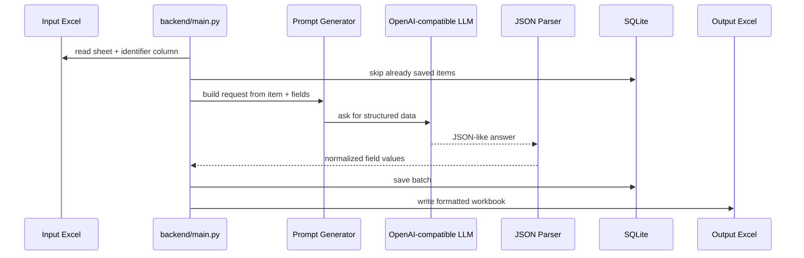

<div align="center">

<p align="center">
  
</p>

<h1 align="center">Factoria</h1>

<p align="center">
  <strong>AI-powered data collection toolkit that finds, structures, stores, and exports information from item lists.</strong>
</p>

<p align="center">
  
  
  
  
  <a href="LICENSE"></a>
</p>

<p align="center">
  
  
  
</p>

<p align="center">
  <a href="#-quick-start">Quick start</a> ·
  <a href="#-features">Features</a> ·
  <a href="#-how-it-works">How it works</a> ·
  <a href="#-configuration">Configuration</a> ·
  <a href="SECURITY.md">Security</a> ·
  <a href="CONTRIBUTING.md">Contributing</a> ·
  <a href="CODE_OF_CONDUCT.md">Code of Conduct</a>
</p>

### Finds and structures any data.

</div>

---

## ✨ What Is Factoria?

**Factoria** turns a spreadsheet of items into structured, searchable data.

Give it an Excel file, define the identifier column and target fields, and it will query an OpenAI-compatible LLM, parse the JSON response, save progress into SQLite, and export a formatted Excel report at the end.

It is built for long-running collection jobs where restarts, partial progress, and repeat runs should not destroy already collected results.

## 💎 Why It Feels Useful

Most data collection scripts break down when the list gets long.

Factoria keeps the workflow boring in the good way:

- **Excel in, Excel out**: use spreadsheets as the operator-facing interface.
- **SQLite checkpointing**: already processed items are skipped on the next run.
- **Structured fields**: responses are parsed into predictable columns.
- **OpenAI-compatible LLMs**: works with DeepSeek/OpenAI-compatible chat APIs through one client.
- **Batch processing**: configurable batch size for controlled throughput.
- **CLI mode**: inspect one item interactively without running the full spreadsheet job.

## 🌟 Features

| Feature | What it does | Status |
| --- | --- | --- |
| 🧾 **Excel input** | Reads item identifiers from a configured sheet and column | Ready |
| 🧠 **LLM extraction** | Sends generated prompts to an OpenAI-compatible chat model | Ready |
| 🧩 **Configurable fields** | Uses `target_fields` to control the output schema | Ready |
| 🗄️ **SQLite storage** | Saves collected rows and avoids duplicate processing | Ready |
| 📊 **Formatted Excel export** | Writes a readable `.xlsx` report with wrapped cells and bold headers | Ready |
| 🖥️ **Single-item CLI** | Query one item and print a Rich table in the terminal | Ready |
| 🧪 **Typed codebase** | Ruff and strict mypy configuration are included | Ready |

## 🧭 How It Works



## ⚡ Quick Start

Install dependencies:

```powershell
uv sync
```

Create local config:

```powershell
Copy-Item .env.example .env
```

Set your API values in `.env`:

```env
OPENAI_API_KEY=your_deepseek_or_openai_api_key_here
OPENAI_BASE_URL=https://api.deepseek.com/v1
MODEL_NAME=deepseek-chat
```

Run the full collector:

```powershell
uv run python backend/main.py
```

Run a single item through the CLI:

```powershell
uv run python backend/cli.py "ABC-123"
```

## ⚙️ Configuration

Runtime settings are loaded from `.env` through `pydantic-settings`.

| Variable | Purpose | Default |
| --- | --- | --- |
| `OPENAI_API_KEY` | API key for the OpenAI-compatible provider | empty |
| `OPENAI_BASE_URL` | Provider base URL | `https://api.deepseek.com/v1` |
| `MODEL_NAME` | Chat model name | `deepseek-chat` |
| `INPUT_FILE` | Excel input path | `input/input.xlsx` |
| `OUTPUT_FILE` | Excel output path | `results/output.xlsx` |
| `SHEET_NAME` | Sheet to read | `Task1` |
| `COLUMN_NAME` | Identifier column name | `Item ID` |
| `BATCH_SIZE` | Rows processed before flushing to SQLite | `5` |
| `DB_PATH` | SQLite database path | `results/database.sqlite` |

Default target fields live in [backend/config.py](backend/config.py). Change `target_fields`, `item_label`, and `system_prompt` there when adapting Factoria to a new domain.

## 🧪 Quality Checks

```powershell
uv run ruff check .
uv run mypy .
```

## 📁 Project Structure

```text
Factoria/
├── backend/
│   ├── cli.py                  # Single-item interactive CLI
│   ├── main.py                 # Batch Excel -> LLM -> SQLite -> Excel runner
│   ├── config.py               # pydantic-settings configuration
│   ├── clients/
│   │   └── llm_client.py       # OpenAI-compatible chat client
│   ├── promts/
│   │   └── generator.py        # Prompt builder
│   └── utils/
│       ├── db_writer.py        # SQLite persistence
│       ├── parse.py            # LLM response parser
│       └── check_columns.py    # Input validation helpers
├── docs/assets/                # README logo and GitHub social preview
├── results/                    # Runtime database and exported workbooks
├── .env.example                # Local configuration template
├── pyproject.toml              # Project metadata and tool config
└── uv.lock                     # Locked dependency graph
```

## 🏷️ Repository Setup Tips

- **Description:** AI data collection toolkit that reads item lists from Excel, extracts structured facts with OpenAI-compatible LLMs, checkpoints to SQLite, and exports formatted reports.
- **Topics:** `python`, `ai`, `data-collection`, `llm`, `openai`, `deepseek`, `sqlite`, `excel`, `automation`, `uv`.
- **Social preview:** upload `docs/assets/github-social-preview.png` in GitHub repository settings.
- **README image:** use `docs/assets/factoria-readme-logo.png` for transparent README branding.
- **Community:** keep [Security](SECURITY.md), [Contributing](CONTRIBUTING.md), [Code of Conduct](CODE_OF_CONDUCT.md), and [License](LICENSE) visible.

---

Made for turning messy item lists into structured data you can actually use.
